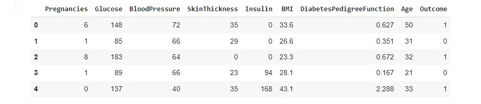
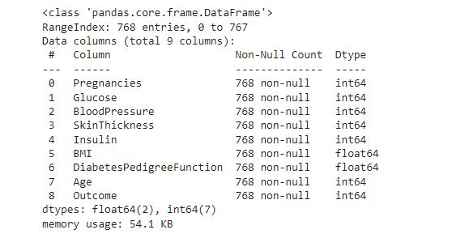
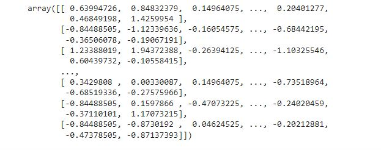
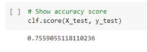

<h1 align="center"> Support Vector Machine </h1>
In this project, the dataset used is Prima Indians Diabetes. This dataset was collected by the National Institute of Diabetes and Digestive and Kidney Diseases. The dataset contains 8 attribute columns and 1 label column which contains 2 classes, namely 1 and 0. The number 1 indicates the person is positive for diabetes and 0 indicates negative. The sample was 768 people consisting of 768 female patients of Indian Pima descent. The machine learning model that will be built aims to classify whether a patient is positive for diabetes or not.

## Pima Indians Dataset Preview

    

## Pima Indians Dataset Information

    

## Rescaling
If you see, the values in the dataset have different scales. For example in the Glucose column and the Diabetes Genealogical Function column. We need to change the value of each attribute to be on the same scale. We can try using standardization with the StandardScaler() function from Scikit Learn.

    

## SVM Model Performance
In the picture above, it turns out that our model produces a fairly good accuracy, which is around 0.75 or 75%.

    

